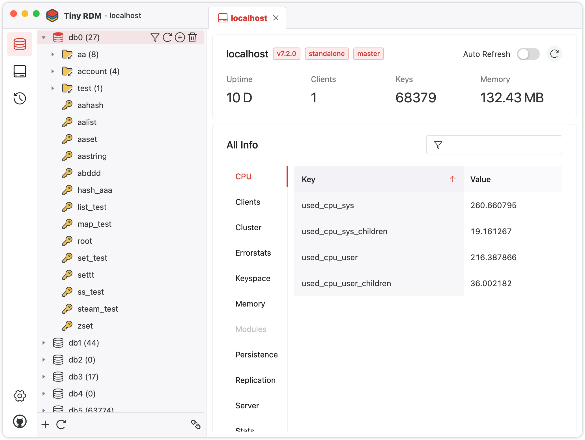

# Tiny RDM

Tiny RDM is a modern lightweight cross-platform Redis desktop manager available for Mac, Windows, and Linux.

## Feature
* Built on Webview, no embedded browsers (Thanks to Wails).
* More elegant UI and visualized layout (Thanks to Naive UI).
* Multi-language support (Click here to contribute and support more languages).
* Convenient data viewing and editing.
* More features under continuous development...

[//]: # (TODO: app previews)
## Installation

We publish binaries for Mac, Windows, and Linux.
Available to download for free from [here](https://github.com/tiny-craft/tiny-rdm/releases).

## License

Tiny RDM is licensed under [GNU General Public](/LICENSE) license.
