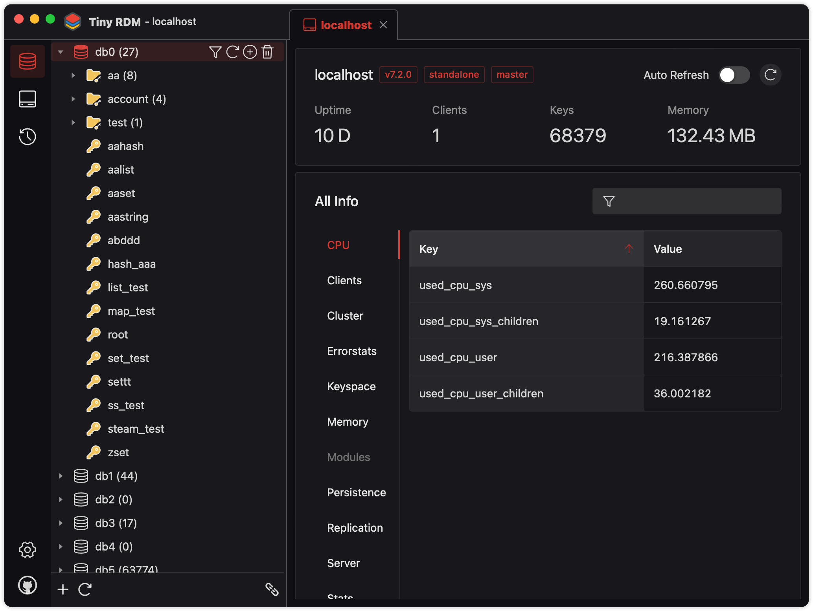
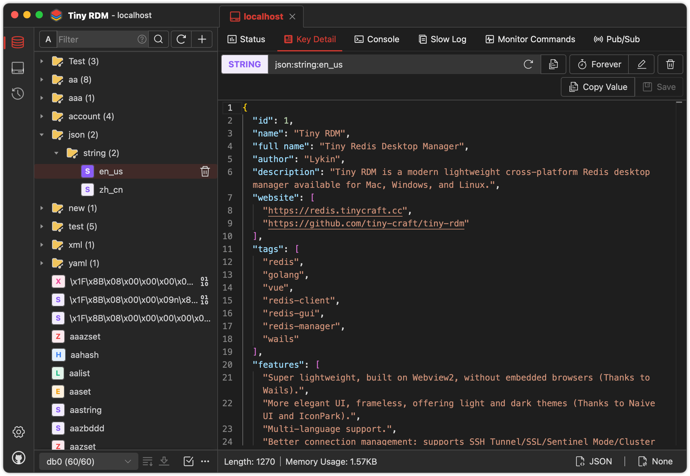
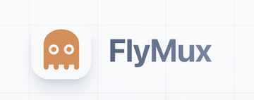

<div align="center">
<a href="https://github.com/tiny-craft/tiny-rdm/"></a>
</div>
<h1 align="center">Tiny RDM</h1>
<h4 align="center"><a href="/">English</a> | <a href="https://github.com/tiny-craft/tiny-rdm/blob/main/README_zh.md">简体中文</a> | <a href="https://github.com/tiny-craft/tiny-rdm/blob/main/README_tw.md">繁體中文</a> | <a href="https://github.com/tiny-craft/tiny-rdm/blob/main/README_ja.md">日本語</a> | <strong>한국어</strong> | <a href="https://github.com/tiny-craft/tiny-rdm/blob/main/README_fr.md">Français</a> | <a href="https://github.com/tiny-craft/tiny-rdm/blob/main/README_es.md">Español</a> | <a href="https://github.com/tiny-craft/tiny-rdm/blob/main/README_pt.md">Português (BR)</a> | <a href="https://github.com/tiny-craft/tiny-rdm/blob/main/README_ru.md">Русский</a> | <a href="https://github.com/tiny-craft/tiny-rdm/blob/main/README_tr.md">Türkçe</a></h4>
<div align="center">

[](https://github.com/tiny-craft/tiny-rdm/blob/main/LICENSE)
[](https://github.com/tiny-craft/tiny-rdm/releases)

[](https://github.com/tiny-craft/tiny-rdm/stargazers)
[](https://github.com/tiny-craft/tiny-rdm/fork)

<strong>Tiny RDM은 Mac, Windows, Linux에서 사용할 수 있는 현대적이고 가벼운 크로스 플랫폼 Redis 데스크톱 관리자입니다. Docker를 통해 배포할 수 있는 웹 버전도
제공합니다.</strong>
</div>

<picture>
 <source media="(prefers-color-scheme: dark)" srcset="screenshots/dark_en.png">
 <source media="(prefers-color-scheme: light)" srcset="screenshots/light_en.png">
 
</picture>

<picture>
 <source media="(prefers-color-scheme: dark)" srcset="screenshots/dark_en2.png">
 <source media="(prefers-color-scheme: light)" srcset="screenshots/light_en2.png">
 
</picture>

## 기능

* 초경량, Webview2 기반으로 내장 브라우저 없음 ([Wails](https://github.com/wailsapp/wails) 감사합니다)
* 시각적이고 사용자 친화적인 UI, 라이트/다크 테마 제공 ([Naive UI](https://github.com/tusen-ai/naive-ui)
  및 [IconPark](https://iconpark.oceanengine.com) 감사합니다)
* 다국어 지원 ([더 많은 언어가 필요하신가요? 여기를 클릭하여 기여하세요](.github/CONTRIBUTING.md))
* 향상된 연결 관리: SSH 터널/SSL/센티널 모드/클러스터 모드/HTTP 프록시/SOCKS5 프록시 지원
* 키-값 작업 시각화, List, Hash, String, Set, Sorted Set, Stream의 CRUD 지원
* 다양한 데이터 보기 형식 및 디코딩/압축 해제 방법 지원
* SCAN을 사용한 분할 로딩으로 수백만 개의 키를 쉽게 나열
* 명령 실행 이력 로그 목록
* 명령줄 모드 제공
* 슬로우 로그 목록 제공
* List/Hash/Set/Sorted Set의 분할 로딩 및 쿼리
* List/Hash/Set/Sorted Set 값의 디코딩/압축 해제 제공
* Monaco Editor 통합
* 실시간 명령 모니터링 지원
* 데이터 가져오기/내보내기 지원
* 발행/구독 지원
* 연결 프로필 가져오기/내보내기 지원
* 값 표시를 위한 사용자 정의 데이터 인코더 및 디코더 ([사용 방법](https://tinyrdm.com/guide/custom-decoder/))

## 설치

[여기](https://github.com/tiny-craft/tiny-rdm/releases)에서 무료로 다운로드할 수 있습니다.

> macOS에서 설치 후 열 수 없는 경우, 다음 명령을 실행한 후 다시 열어주세요:
> ``` shell
>  sudo xattr -d com.apple.quarantine /Applications/Tiny\ RDM.app
> ```

## 빌드 가이드

### 사전 요구 사항

* Go (최신 버전)
* Node.js >= 20
* NPM >= 9

### Wails 설치

```bash
go install github.com/wailsapp/wails/v2/cmd/wails@latest
```

### 코드 가져오기

```bash
git clone https://github.com/tiny-craft/tiny-rdm --depth=1
```

### 프론트엔드 빌드

```bash
npm install --prefix ./frontend
```

또는

```bash
cd frontend
npm install
```

### 컴파일 및 실행

```bash
wails dev
```

## Docker 배포

데스크톱 클라이언트 외에도 Tiny RDM은 Docker를 통해 빠르게 배포할 수 있는 웹 버전을 제공합니다.

### Docker Compose 사용 (권장)

`docker-compose.yml` 파일을 생성합니다:

```yaml
services:
  tinyrdm:
    image: ghcr.io/tiny-craft/tiny-rdm:latest
    container_name: tinyrdm
    restart: unless-stopped
    ports:
      - "8086:8086"
    environment:
      - ADMIN_USERNAME=admin
      - ADMIN_PASSWORD=tinyrdm
    volumes:
      - ./data:/app/tinyrdm
```

서비스를 시작합니다:

```bash
docker compose up -d
```

시작 후 `http://localhost:8086`에 접속하여 위에서 설정한 사용자 이름과 비밀번호로 로그인하세요.

### Docker 명령 사용

```bash
docker run -d --name tinyrdm \
  -p 8086:8086 \
  -e ADMIN_USERNAME=admin \
  -e ADMIN_PASSWORD=tinyrdm \
  -v ./data:/app/tinyrdm \
  ghcr.io/tiny-craft/tiny-rdm:latest
```

### 환경 변수

| 변수               | 설명         | 기본값 |
|------------------|------------|-----|
| `ADMIN_USERNAME` | 로그인 사용자 이름 | -   |
| `ADMIN_PASSWORD` | 로그인 비밀번호   | -   |

## 스폰서

다음 서비스 제공업체의 호스팅 후원에 감사드립니다

<table>
<tr>
<td width="200"><a href="https://flymux.com/register?promo=TINYRDM"></a></td>
<td>이 프로젝트를 후원해 준 FlyMux에 특별히 감사드립니다! FlyMux는 Claude Code와 Codex를 위한 공식 고안정 중계 서비스 제공에 집중하며, 개발자에게 매끄럽고 효율적인 AI 코딩 연동 경험을 제공하고 있습니다. TinyRDM 사용자 전용 혜택으로 <a href="https://flymux.com/register?promo=TINYRDM">이 링크</a>를 통해 가입하면 계정에 $5 보너스 크레딧이 자동으로 지급됩니다.</td>
</tr>
<tr>
<td width="200"><a href="https://www.notidc.com/"></a></td>
<td>이 프로젝트를 후원해 준 NotiDC에 특별히 감사드립니다! NotIDC는 클라우드 서버, 베어메탈, CDN, 보안 솔루션을 포함한 고성능 클라우드 인프라를 제공하며, 글로벌 네트워크 커버리지와 안정적인 DDoS 방어를 바탕으로 개발자가 애플리케이션을 효율적으로 배포하고 확장할 수 있도록 돕습니다.</td>
</tr>
</table>

## 소개

### 위챗 공식 계정


