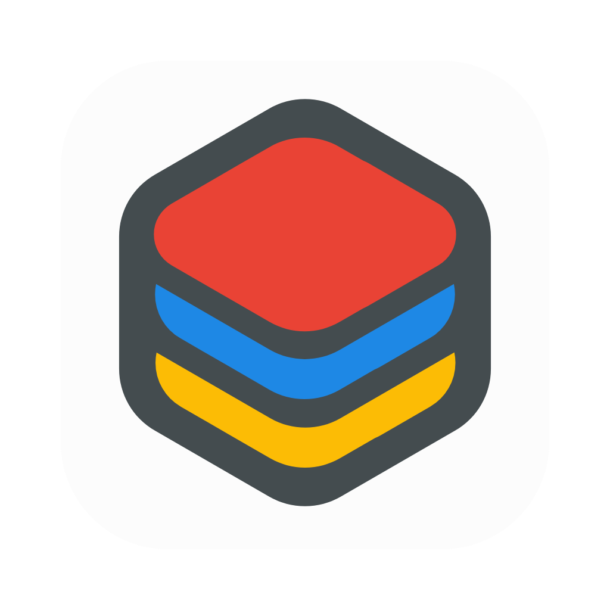
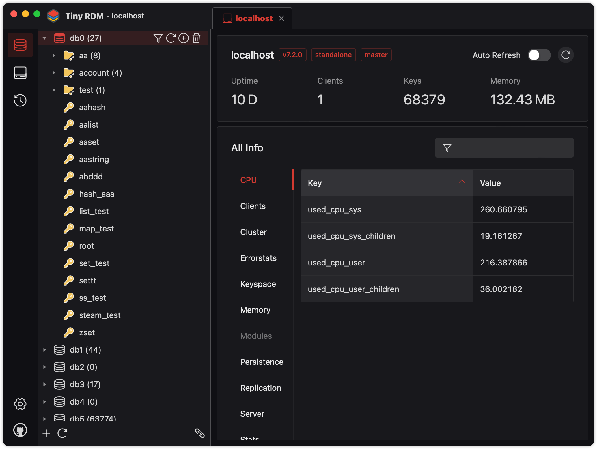
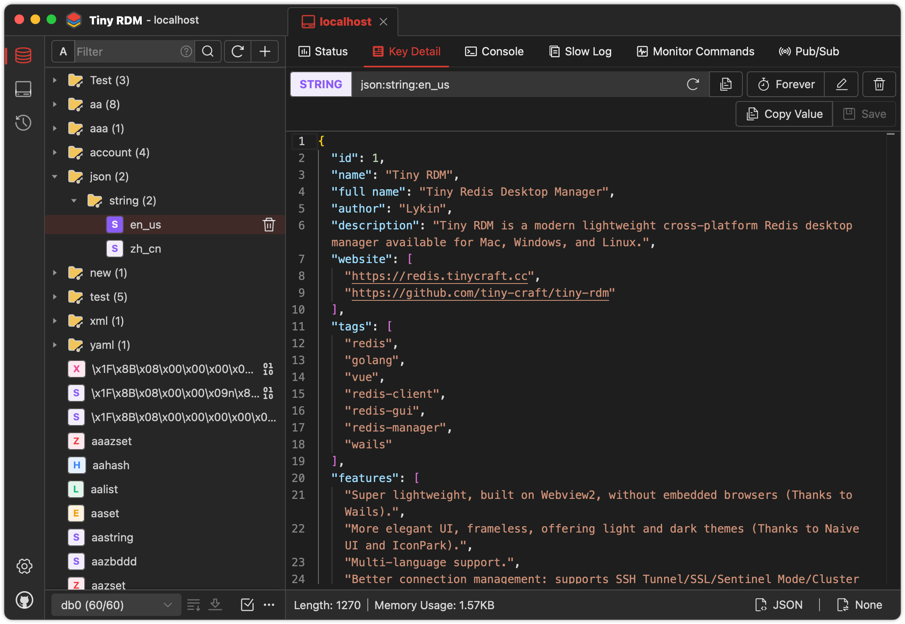

<div align="center">
<a href="https://github.com/tiny-craft/tiny-rdm/"></a>
</div>
<h1 align="center">Tiny RDM</h1>
<h4 align="center"><a href="/">English</a> | <a href="https://github.com/tiny-craft/tiny-rdm/blob/main/README_zh.md">简体中文</a> | <a href="https://github.com/tiny-craft/tiny-rdm/blob/main/README_tw.md">繁體中文</a> | <a href="https://github.com/tiny-craft/tiny-rdm/blob/main/README_ja.md">日本語</a> | <a href="https://github.com/tiny-craft/tiny-rdm/blob/main/README_ko.md">한국어</a> | <a href="https://github.com/tiny-craft/tiny-rdm/blob/main/README_fr.md">Français</a> | <a href="https://github.com/tiny-craft/tiny-rdm/blob/main/README_es.md">Español</a> | <a href="https://github.com/tiny-craft/tiny-rdm/blob/main/README_pt.md">Português (BR)</a> | <strong>Русский</strong> | <a href="https://github.com/tiny-craft/tiny-rdm/blob/main/README_tr.md">Türkçe</a></h4>
<div align="center">

[](https://github.com/tiny-craft/tiny-rdm/blob/main/LICENSE)
[](https://github.com/tiny-craft/tiny-rdm/releases)

[](https://github.com/tiny-craft/tiny-rdm/stargazers)
[](https://github.com/tiny-craft/tiny-rdm/fork)

<strong>Tiny RDM — современный легковесный кроссплатформенный менеджер Redis для Mac, Windows и Linux. Также доступна веб-версия с возможностью развёртывания через Docker.</strong>
</div>

<picture>
 <source media="(prefers-color-scheme: dark)" srcset="screenshots/dark_en.png">
 <source media="(prefers-color-scheme: light)" srcset="screenshots/light_en.png">
 
</picture>

<picture>
 <source media="(prefers-color-scheme: dark)" srcset="screenshots/dark_en2.png">
 <source media="(prefers-color-scheme: light)" srcset="screenshots/light_en2.png">
 
</picture>

## Возможности

* Сверхлёгкий, на базе Webview2, без встроенного браузера (Спасибо [Wails](https://github.com/wailsapp/wails))
* Визуально приятный и удобный интерфейс, светлая и тёмная темы (Спасибо [Naive UI](https://github.com/tusen-ai/naive-ui) и [IconPark](https://iconpark.oceanengine.com))
* Поддержка нескольких языков ([Нужно больше языков? Нажмите здесь, чтобы помочь](.github/CONTRIBUTING.md))
* Улучшенное управление подключениями: SSH-туннель/SSL/режим Sentinel/режим Cluster/HTTP-прокси/SOCKS5-прокси
* Визуализация операций с ключами, поддержка CRUD для List, Hash, String, Set, Sorted Set и Stream
* Поддержка множества форматов отображения и методов декодирования/распаковки
* Сегментированная загрузка через SCAN для удобной работы с миллионами ключей
* Журнал истории выполненных команд
* Режим командной строки
* Список медленных запросов
* Сегментированная загрузка и запросы для List/Hash/Set/Sorted Set
* Декодирование/распаковка значений для List/Hash/Set/Sorted Set
* Интеграция с Monaco Editor
* Мониторинг команд в реальном времени
* Импорт/экспорт данных
* Публикация/подписка
* Импорт/экспорт профилей подключений
* Пользовательские кодировщики и декодировщики для отображения значений ([Инструкция](https://tinyrdm.com/guide/custom-decoder/))

## Установка

Доступно для бесплатного скачивания [здесь](https://github.com/tiny-craft/tiny-rdm/releases).

> Если после установки на macOS приложение не открывается, выполните следующую команду и попробуйте снова:
> ``` shell
>  sudo xattr -d com.apple.quarantine /Applications/Tiny\ RDM.app
> ```

## Руководство по сборке

### Требования

* Go (последняя версия)
* Node.js >= 20
* NPM >= 9

### Установка Wails

```bash
go install github.com/wailsapp/wails/v2/cmd/wails@latest
```

### Получение кода

```bash
git clone https://github.com/tiny-craft/tiny-rdm --depth=1
```

### Сборка фронтенда

```bash
npm install --prefix ./frontend
```

или

```bash
cd frontend
npm install
```

### Компиляция и запуск

```bash
wails dev
```

## Развёртывание через Docker

Помимо десктопного клиента, Tiny RDM предоставляет веб-версию, которую можно быстро развернуть через Docker.

### С помощью Docker Compose (рекомендуется)

Создайте файл `docker-compose.yml`:

```yaml
services:
  tinyrdm:
    image: ghcr.io/tiny-craft/tiny-rdm:latest
    container_name: tinyrdm
    restart: unless-stopped
    ports:
      - "8086:8086"
    environment:
      - ADMIN_USERNAME=admin
      - ADMIN_PASSWORD=tinyrdm
    volumes:
      - ./data:/app/tinyrdm
```

Запустите сервис:

```bash
docker compose up -d
```

После запуска откройте `http://localhost:8086` и войдите с указанными выше учётными данными.

### С помощью команды Docker

```bash
docker run -d --name tinyrdm \
  -p 8086:8086 \
  -e ADMIN_USERNAME=admin \
  -e ADMIN_PASSWORD=tinyrdm \
  -v ./data:/app/tinyrdm \
  ghcr.io/tiny-craft/tiny-rdm:latest
```

### Переменные окружения

| Переменная | Описание | По умолчанию |
|------------|----------|--------------|
| `ADMIN_USERNAME` | Имя пользователя | - |
| `ADMIN_PASSWORD` | Пароль | - |

## О проекте

### Спонсорство

Если этот проект оказался полезным, угостите автора чашкой кофе ☕️

* Wechat Sponsor


