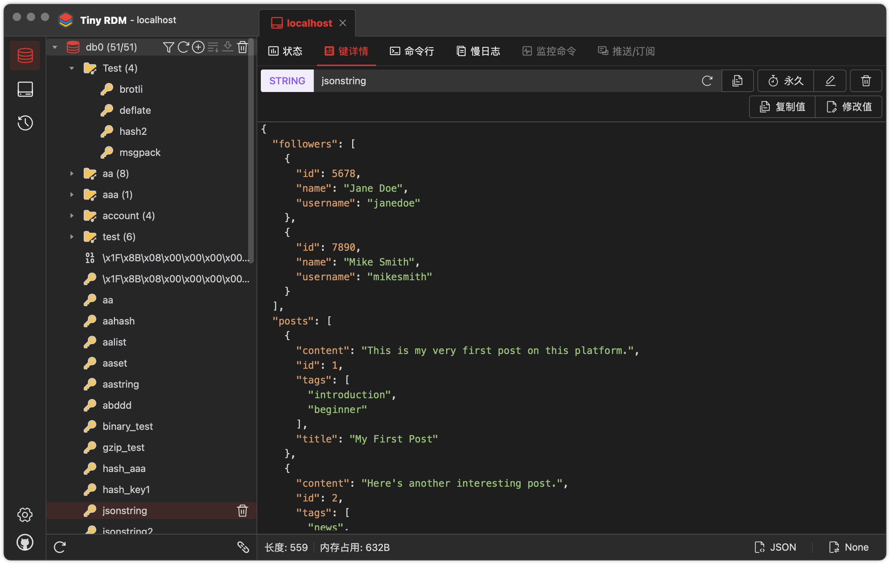

<h4 align="right"><strong><a href="/">English</a></strong> | 简体中文</h4>
<div align="center">
<a href="https://github.com/tiny-craft/tiny-rdm/"></a>
</div>
<h1 align="center">Tiny RDM</h1>
<div align="center">

[](https://github.com/tiny-craft/tiny-rdm/blob/main/LICENSE)
[](https://github.com/tiny-craft/tiny-rdm/releases)
[](https://github.com/tiny-craft/tiny-rdm/stargazers)
[](https://github.com/tiny-craft/tiny-rdm/fork)
[](https://discord.gg/VTFbBMGjWh)
[](https://twitter.com/Lykin53448)

<strong>一个现代化轻量级的跨平台Redis桌面客户端，支持Mac、Windows和Linux</strong>
</div>

<picture>
 <source media="(prefers-color-scheme: dark)" srcset="screenshots/dark_zh.png">
 <source media="(prefers-color-scheme: light)" srcset="screenshots/light_zh.png">
 
</picture>

## 功能特性

* 极度轻量，基于Webview2，无内嵌浏览器（感谢[Wails](https://github.com/wailsapp/wails)）
* 更精美的界面，无边框窗口，提供浅色/深色主题（感谢[Naive UI](https://github.com/tusen-ai/naive-ui)
  和 [IconPark](https://iconpark.oceanengine.com)）
* 多国语言支持：英文/中文（[需要更多语言支持？点我贡献语言](.github/CONTRIBUTING_zh.md)）
* 更好用的连接管理：支持SSH隧道/SSL/哨兵模式/集群模式
* 可视化键值操作，增删查改一应俱全
* 支持多种数据查看格式以及转码/解压方式
* 采用SCAN分段加载，可轻松处理数百万键列表
* 操作命令执行日志展示
* 提供命令行操作
* 提供慢日志展示
* List/Hash/Set/Sorted Set的分段加载和查询
* List/Hash/Set/Sorted Set值的转码显示
* 内置高级编辑器Monaco Editor
* 支持命令实时监控
* 支持数据导入/导出

## 未来版本规划

- [ ] 发布/订阅支持
- [ ] 连接配置导入/导出

## 安装

提供Mac、Windows和Linux安装包，可[免费下载](https://github.com/tiny-craft/tiny-rdm/releases)。

> 如果在macOS上安装后无法打开，报错**不受信任**或者**移到垃圾箱**，执行下面命令后再启动即可：
> ``` shell
>  sudo xattr -d com.apple.quarantine /Applications/Tiny\ RDM.app
> ```

## 构建项目

### 运行环境要求

* Go（最新版本）
* Node.js >= 16
* NPM >= 9

### 安装wails

```bash
go install github.com/wailsapp/wails/v2/cmd/wails@latest
```

### 拉取代码

```bash
git clone https://github.com/tiny-craft/tiny-rdm --depth=1
```

### 构建前端代码

```bash
npm install --prefix ./frontend
```

### 编译运行开发版本

```bash
wails dev
```

## 关于

此APP由我个人开发，也作为本人第一个开源项目的尝试，由于精力有限，可能会存在BUG或者使用体验上的问题，欢迎提交issue和PR。
同时本人也在探索开源代码、独立开发和盈利性商业应用之间的平衡关系，欢迎有共同意向的小伙伴加入群聊探讨和交换想法。

* QQ群：831077639

## 开源许可

Tiny RDM 基于 [GNU General Public](/LICENSE) 开源协议.
