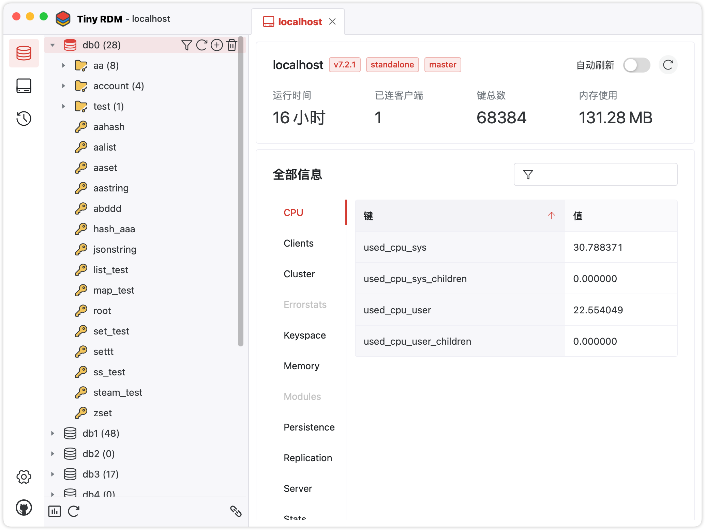

<h4 align="right"><strong><a href="/">English</a></strong> | 简体中文</h4>

    

<h1 align="center">Tiny RDM</h1>

<strong>一个现代化轻量级的跨平台Redis桌面客户端，支持Mac、Windows和Linux</strong>

## 功能特性

* 基于Webview，无内嵌浏览器（感谢[Wails](https://github.com/wailsapp/wails)）
* 更精美的界面和直观的结构布局（感谢[Naive UI](https://github.com/tusen-ai/naive-ui)
  和 [IconPark](https://iconpark.oceanengine.com)）
* 多国语言支持（点我贡献和完善多国语言支持）
* 便捷的数据查看和编辑修改
* 更多功能持续开发中…

## 安装

提供Mac、Windows和Linux下载安装，可[免费下载](https://github.com/tiny-craft/tiny-rdm/releases)。

## 关于
此APP由我个人开发，也作为本人第一个开源项目的尝试，由于精力有限，可能会存在BUG或者使用体验上的问题，欢迎提交issue和PR。
同时本人也在探索开源代码、独立开发和盈利性商业应用之间的平衡关系，欢迎有共同意向的小伙伴加入群聊探讨和交换想法。
* QQ群：831077639

## 开源许可

Tiny RDM 基于 [GNU General Public](/LICENSE) 开源协议.
