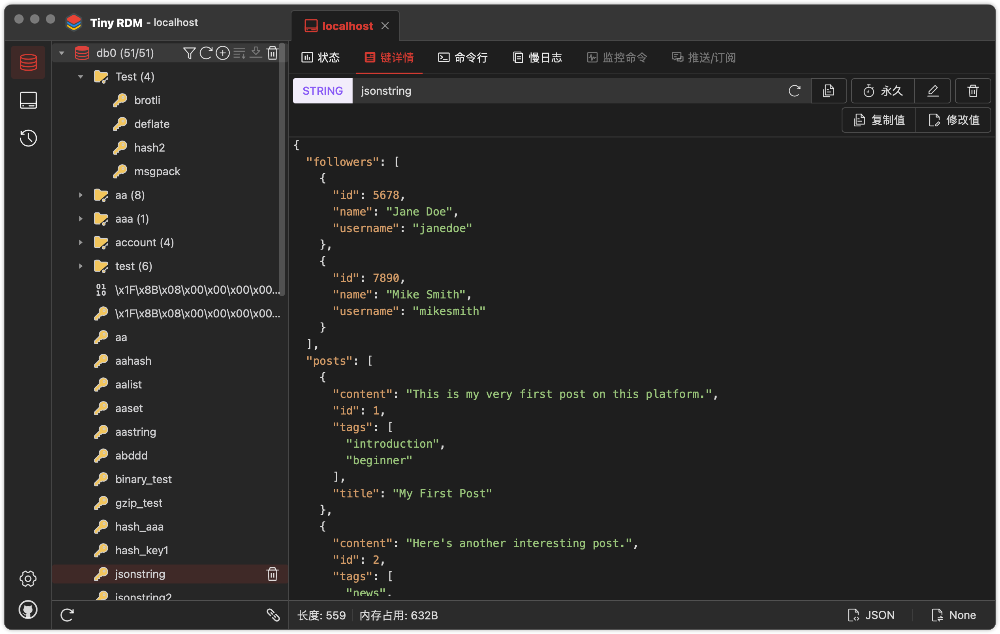
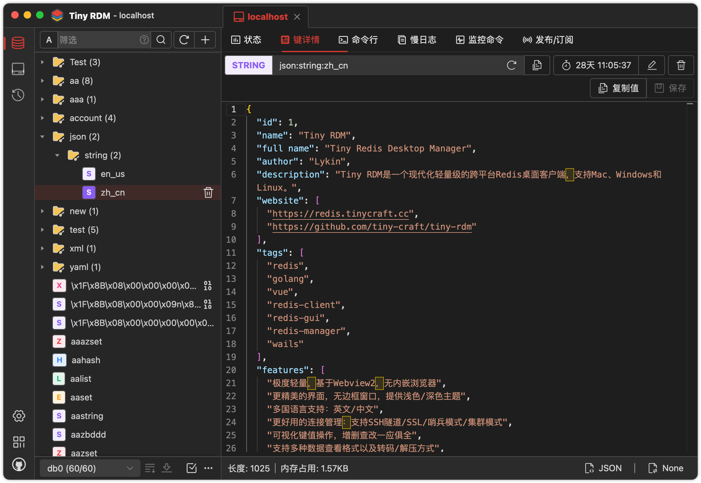

<div align="center">
<a href="https://github.com/tiny-craft/tiny-rdm/"></a>
</div>
<h1 align="center">Tiny RDM</h1>
<h4 align="center"><a href="/">English</a> | <strong>简体中文</strong> | <a href="https://github.com/tiny-craft/tiny-rdm/blob/main/README_tw.md">繁體中文</a> | <a href="https://github.com/tiny-craft/tiny-rdm/blob/main/README_ja.md">日本語</a> | <a href="https://github.com/tiny-craft/tiny-rdm/blob/main/README_ko.md">한국어</a> | <a href="https://github.com/tiny-craft/tiny-rdm/blob/main/README_fr.md">Français</a> | <a href="https://github.com/tiny-craft/tiny-rdm/blob/main/README_es.md">Español</a> | <a href="https://github.com/tiny-craft/tiny-rdm/blob/main/README_pt.md">Português (BR)</a> | <a href="https://github.com/tiny-craft/tiny-rdm/blob/main/README_ru.md">Русский</a> | <a href="https://github.com/tiny-craft/tiny-rdm/blob/main/README_tr.md">Türkçe</a></h4>
<div align="center">

[](https://github.com/tiny-craft/tiny-rdm/blob/main/LICENSE)
[](https://github.com/tiny-craft/tiny-rdm/releases)

[](https://github.com/tiny-craft/tiny-rdm/stargazers)
[](https://github.com/tiny-craft/tiny-rdm/fork)

<str>一个现代化轻量级的跨平台Redis桌面客户端，支持Mac、Windows和Linux，同时提供Web版本，可通过Docker快速部署</strong>
</div>

<picture>
 <source media="(prefers-color-scheme: dark)" srcset="screenshots/dark_zh.png">
 <source media="(prefers-color-scheme: light)" srcset="screenshots/light_zh.png">
 
</picture>

<picture>
 <source media="(prefers-color-scheme: dark)" srcset="screenshots/dark_zh2.png">
 <source media="(prefers-color-scheme: light)" srcset="screenshots/light_zh2.png">
 
</picture>

## 功能特性

* 极度轻量，基于Webview2，无内嵌浏览器（感谢[Wails](https://github.com/wailsapp/wails)）
* 界面精美易用，提供浅色/深色主题（感谢[Naive UI](https://github.com/tusen-ai/naive-ui)
  和 [IconPark](https://iconpark.oceanengine.com)）
* 多国语言支持：英文/中文（[需要更多语言支持？点我贡献语言](.github/CONTRIBUTING_zh.md)）
* 更好用的连接管理：支持SSH隧道/SSL/哨兵模式/集群模式/HTTP代理/SOCKS5代理
* 可视化键值操作，增删查改一应俱全
* 支持多种数据查看格式以及转码/解压方式
* 采用SCAN分段加载，可轻松处理数百万键列表
* 操作命令执行日志展示
* 提供命令行操作
* 提供慢日志展示
* List/Hash/Set/Sorted Set的分段加载和查询
* List/Hash/Set/Sorted Set值的转码显示
* 内置高级编辑器Monaco Editor
* 支持命令实时监控
* 支持导入/导出数据
* 支持发布订阅
* 支持导入/导出连接配置
* 自定义数据展示编码/解码([这是操作指引](https://tinyrdm.com/zh/guide/custom-decoder/))

## 安装

提供Mac、Windows和Linux安装包，可[免费下载](https://github.com/tiny-craft/tiny-rdm/releases)。

> 如果在macOS上安装后无法打开，报错**不受信任**或者**移到垃圾箱**，执行下面命令后再启动即可：
> ``` shell
>  sudo xattr -d com.apple.quarantine /Applications/Tiny\ RDM.app
> ```

## 构建客户端

### 运行环境要求

* Go（最新版本）
* Node.js >= 20
* NPM >= 9

### 安装wails

```bash
go install github.com/wailsapp/wails/v2/cmd/wails@latest
```

### 拉取代码

```bash
git clone https://github.com/tiny-craft/tiny-rdm --depth=1
```

### 构建前端代码

```bash
npm install --prefix ./frontend
```

或者

```bash
cd frontend
npm install
```

### 编译运行开发版本

```bash
wails dev
```

## Docker 部署

除桌面客户端外，Tiny RDM 还提供 Web 版本，可通过 Docker 快速部署。

### 使用 Docker Compose（推荐）

创建 `docker-compose.yml` 文件：

```yaml
services:
  tinyrdm:
    image: ghcr.io/tiny-craft/tiny-rdm:latest
    container_name: tinyrdm
    restart: unless-stopped
    ports:
      - "8086:8086"
    environment:
      - ADMIN_USERNAME=admin
      - ADMIN_PASSWORD=tinyrdm
    volumes:
      - ./data:/app/tinyrdm
```

启动服务：

```bash
docker compose up -d
```

启动后访问 `http://localhost:8086`，使用上面配置的用户名密码登录。

### 使用 Docker 命令

```bash
docker run -d --name tinyrdm \
  -p 8086:8086 \
  -e ADMIN_USERNAME=admin \
  -e ADMIN_PASSWORD=tinyrdm \
  -v ./data:/app/tinyrdm \
  ghcr.io/tiny-craft/tiny-rdm:latest
```

### 环境变量说明

| 变量               | 说明    | 默认值 |
|------------------|-------|-----|
| `ADMIN_USERNAME` | 登录用户名 | -   |
| `ADMIN_PASSWORD` | 登录密码  | -   |

## 感谢赞助

感谢以下服务商提供主机赞助

<table>
<tr>
<td width="200"><a href="https://flymux.com/register?promo=TINYRDM"></a></td>
<td>感谢 FlyMux 赞助了本项目！FlyMux 致力于提供 Claude Code 与 Codex 官方高稳定中转服务，专注于为开发者打造流畅、便捷的 AI 编程接入体验。FlyMux 为 TinyRDM 用户提供了专属特别福利：通过<a href="https://flymux.com/register?promo=TINYRDM">此链接</a>账号直接到账 $5 赠送额度！</td>
</tr>
<td width="200"><a href="https://www.notidc.com/"></a></td>
<td>感谢 NotiDC 赞助了本项目！NotIDC 提供高性能云服务器、裸金属、CDN 及安全防护等基础设施服务，具备全球网络覆盖与稳定的抗 DDoS 能力，助力开发者高效部署与扩展应用。</td>
</table>

## 关于

如果你也同为独立开发者（团队），喜欢开源，或者对Tiny Craft的相关产品感兴趣，可以关注微信公众号或者加入QQ群，探讨心得，反馈意见，交个朋友。

### 微信公众号（用户交流微信群）

我会不定期更新一些关于独立开发的思考和感悟，以及独立产品的介绍，欢迎扫码关注~👏


### B站官方账号


### 独立开发互助QQ群

```
831077639
```

### 赞助

该项目完全为爱发电，如果对你有所帮助，可以请作者喝杯咖啡 ☕️

* 微信赞赏


